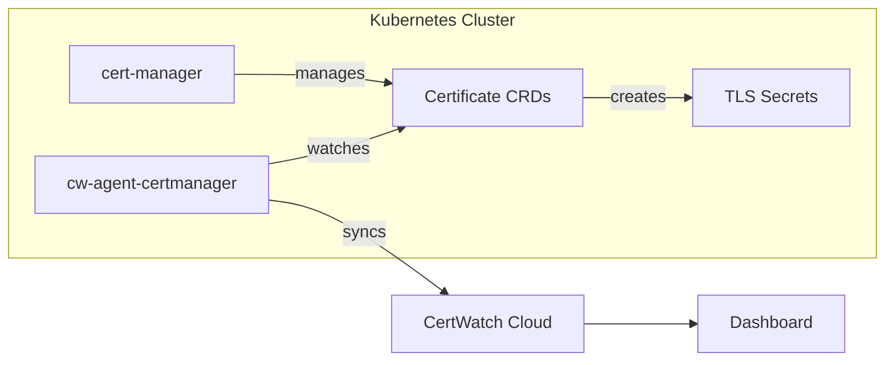

The **cw-agent-certmanager** automatically discovers and monitors all certificates managed by [cert-manager](https://cert-manager.io) in your Kubernetes cluster.

## Why Monitor cert-manager Certificates?

<CardGroup cols={2}>
  <Card title="Automatic Discovery" icon="magnifying-glass">
    No manual configuration. Watches all Certificate CRDs across namespaces.
  </Card>
  <Card title="Renewal Tracking" icon="rotate">
    Track renewal status and get alerts before certificates expire.
  </Card>
  <Card title="Issuer Visibility" icon="stamp">
    See which ClusterIssuer or Issuer manages each certificate.
  </Card>
  <Card title="Centralized Dashboard" icon="chart-line">
    View all cluster certificates alongside network-scanned certificates.
  </Card>
</CardGroup>

## How It Works



The agent:
1. Watches Certificate custom resources using the Kubernetes API
2. Extracts certificate metadata (expiry, issuer, status)
3. Syncs to CertWatch cloud every 30 seconds (configurable)
4. Detects renewals and status changes in real-time

## Prerequisites

- Kubernetes 1.19+
- Helm 3.8+
- **cert-manager** v1.0+ installed
- CertWatch API key with `cloud:sync` scope

## Installation

### Step 1: Create API Key Secret

```bash
kubectl create secret generic cw-api-key \
  --from-literal=api-key=cw_your_key_here
```

### Step 2: Install the Helm Chart

```bash
helm install cw-certmanager oci://ghcr.io/certwatch-app/helm-charts/cw-agent-certmanager \
  --set agent.name=my-cluster \
  --set agent.clusterName="Production K8s" \
  --set apiKey.existingSecret.name=cw-api-key
```

### Step 3: Verify

```bash
kubectl get pods -l app.kubernetes.io/name=cw-agent-certmanager
kubectl logs -l app.kubernetes.io/name=cw-agent-certmanager -f
```

## Configuration

### Full Values Example

```yaml
agent:
  name: production-certmanager
  clusterName: "Production Cluster"
  logLevel: info
  metricsPort: 9402
  healthPort: 9403
  syncInterval: "30s"
  heartbeatInterval: "30s"
  watchAllNamespaces: true
  # namespaces:
  #   - production
  #   - staging

apiKey:
  existingSecret:
    name: cw-api-key
    key: api-key

serviceMonitor:
  enabled: true
  labels:
    release: prometheus

resources:
  limits:
    cpu: 200m
    memory: 128Mi
  requests:
    cpu: 50m
    memory: 64Mi
```

### Configuration Reference

| Parameter | Default | Description |
|-----------|---------|-------------|
| `agent.name` | `""` | **Required.** Unique agent identifier |
| `agent.clusterName` | agent.name | Friendly name shown in dashboard |
| `agent.watchAllNamespaces` | `true` | Monitor certificates in all namespaces |
| `agent.namespaces` | `[]` | Specific namespaces (when not watching all) |
| `agent.syncInterval` | `30s` | How often to sync with CertWatch cloud |
| `agent.metricsPort` | `9402` | Prometheus metrics endpoint |
| `agent.healthPort` | `9403` | Health check endpoint |

## Namespace Filtering

### Watch All Namespaces (Default)

```yaml
agent:
  watchAllNamespaces: true
```

### Watch Specific Namespaces

```yaml
agent:
  watchAllNamespaces: false
  namespaces:
    - production
    - staging
    - cert-manager  # To see cert-manager's own certs
```

## What Gets Synced

For each cert-manager Certificate, the agent syncs:

| Field | Source |
|-------|--------|
| Hostname | Certificate spec.dnsNames[0] |
| Expiry | Secret's certificate notAfter |
| Issuer | Certificate spec.issuerRef |
| Status | Certificate status.conditions |
| Namespace | Certificate metadata.namespace |
| Renewal Time | Certificate status.renewalTime |

## RBAC Permissions

The Helm chart creates a ClusterRole with these permissions:

```yaml
- apiGroups: ["cert-manager.io"]
  resources: ["certificates", "certificaterequests"]
  verbs: ["get", "list", "watch"]
- apiGroups: [""]
  resources: ["secrets"]
  verbs: ["get", "list", "watch"]
- apiGroups: [""]
  resources: ["events"]
  verbs: ["create", "patch"]
```

## Troubleshooting

### Agent Not Discovering Certificates

```bash
# Check agent logs
kubectl logs -l app.kubernetes.io/name=cw-agent-certmanager

# Verify RBAC
kubectl auth can-i list certificates.cert-manager.io \
  --as=system:serviceaccount:default:cw-agent-certmanager

# List certificates the agent should see
kubectl get certificates --all-namespaces
```

### Certificates Not Appearing in Dashboard

1. Verify agent is connected (check heartbeat in dashboard)
2. Check sync interval hasn't been set too high
3. Confirm API key has `cloud:sync` scope

<Card title="Full Kubernetes Guide" icon="dharmachakra" href="/agent/kubernetes">
  See deployment options including GitOps, ServiceMonitor, and cw-stack umbrella chart.
</Card>
