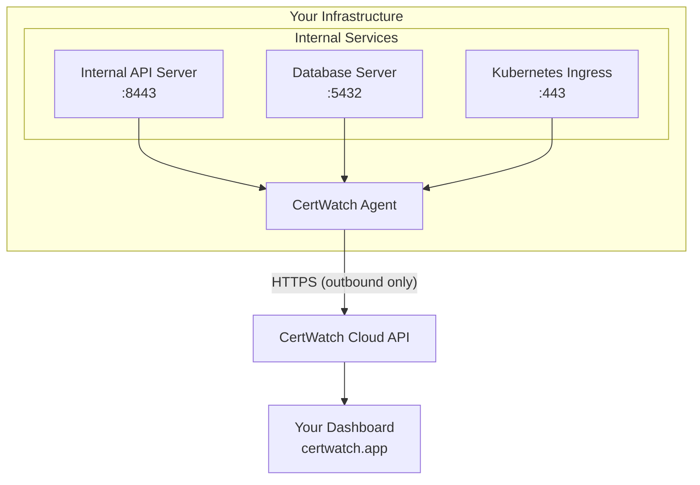

The CertWatch Agent is a lightweight monitoring daemon that runs on your infrastructure to monitor SSL/TLS certificates that aren't publicly accessible.

## Why Use the Agent?

<CardGroup cols={2}>
  <Card title="Private Endpoints" icon="lock">
    Monitor certificates on internal services, VPNs, and private networks that CertWatch can't reach from the cloud.
  </Card>
  <Card title="Behind Firewalls" icon="shield">
    No need to open inbound ports. The agent connects outbound to sync data.
  </Card>
  <Card title="On-Premise" icon="server">
    Perfect for air-gapped environments, data centers, and compliance-restricted networks.
  </Card>
  <Card title="Real-time Sync" icon="refresh">
    Certificate data syncs to your CertWatch dashboard automatically.
  </Card>
</CardGroup>

## How It Works



## Features

- **Single Binary** - No dependencies, just download and run
- **Config-Driven** - Define certificates in a simple YAML file
- **Interactive Setup** - `cw-agent init` wizard guides configuration
- **State Persistence** - Agent ID survives restarts
- **Secure** - Runs without root, uses TLS for all communication
- **Lightweight** - Minimal CPU and memory footprint

## Quick Start

<Steps>
  <Step title="Install">
    ```bash
    curl -sSL https://certwatch.app/install.sh | bash
    ```
  </Step>
  <Step title="Configure">
    ```bash
    cw-agent init
    ```
  </Step>
  <Step title="Start">
    ```bash
    cw-agent start -c certwatch.yaml
    ```
  </Step>
</Steps>

<Card title="Full Installation Guide" icon="download" href="/agent/installation">
  See all installation options including Docker, Homebrew, and manual download.
</Card>
