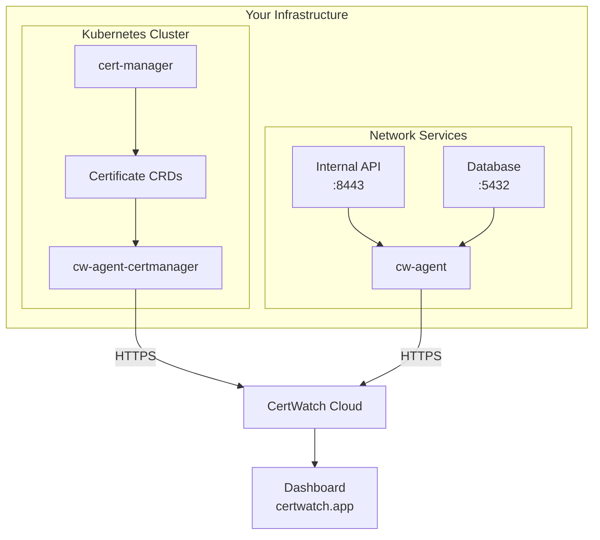

The CertWatch Agent is a lightweight monitoring daemon that runs on your infrastructure to monitor SSL/TLS certificates that aren't publicly accessible.

## Why Use the Agent?

<CardGroup cols={2}>
  <Card title="Private Endpoints" icon="lock">
    Monitor certificates on internal services, VPNs, and private networks that CertWatch can't reach from the cloud.
  </Card>
  <Card title="Behind Firewalls" icon="shield">
    No need to open inbound ports. The agent connects outbound to sync data.
  </Card>
  <Card title="On-Premise" icon="server">
    Perfect for air-gapped environments, data centers, and compliance-restricted networks.
  </Card>
  <Card title="Real-time Sync" icon="refresh">
    Certificate data syncs to your CertWatch dashboard automatically.
  </Card>
</CardGroup>

## Agent Types

CertWatch offers two agent types for different use cases:

<CardGroup cols={2}>
  <Card title="Network Agent" icon="network-wired" href="/agent/kubernetes">
    Scans TLS certificates from network endpoints. Ideal for monitoring internal APIs, databases, and services.
  </Card>
  <Card title="cert-manager Agent" icon="dharmachakra" href="/agent/cert-manager">
    Monitors certificates managed by cert-manager in Kubernetes. Automatic discovery of all Certificate CRDs.
  </Card>
</CardGroup>

## How It Works



## Features

- **Single Binary** - No dependencies, just download and run
- **Config-Driven** - Define certificates in a simple YAML file
- **Interactive Setup** - `cw-agent init` wizard guides configuration
- **State Persistence** - Agent ID survives restarts
- **Secure** - Runs without root, uses TLS for all communication
- **Lightweight** - Minimal CPU and memory footprint
- **Prometheus Metrics** - Expose certificate and agent metrics at `/metrics`
- **Health Endpoints** - Kubernetes-ready `/healthz`, `/readyz`, `/livez` endpoints
- **Heartbeat Support** - Agent offline detection and alerting
- **Helm Charts** - Official Helm charts for Kubernetes with GitOps support
- **cert-manager Integration** - Auto-discover certificates from cert-manager CRDs
- **Umbrella Chart** - Deploy both agents with `cw-stack` Helm chart

## Quick Start

<Steps>
  <Step title="Install">
    ```bash
    curl -sSL https://certwatch.app/install.sh | bash
    ```
  </Step>
  <Step title="Configure">
    ```bash
    cw-agent init
    ```
  </Step>
  <Step title="Start">
    ```bash
    cw-agent start -c certwatch.yaml
    ```
  </Step>
</Steps>

<CardGroup cols={2}>
  <Card title="Full Installation Guide" icon="download" href="/agent/installation">
    See all installation options including Docker, Homebrew, Helm, and manual download.
  </Card>
  <Card title="Kubernetes Deployment" icon="dharmachakra" href="/agent/kubernetes">
    Deploy with our official Helm chart for Kubernetes clusters.
  </Card>
</CardGroup>
